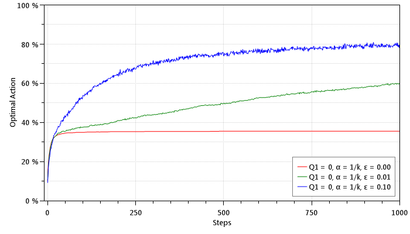
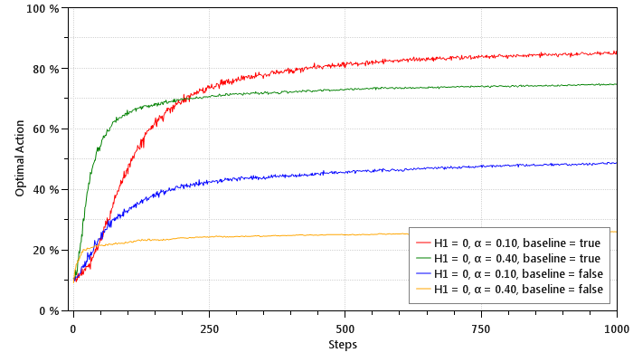

## Multi-arm Bandits

*Chapter 2*

#### Epsilon Greedy

This is a reproduction of Figure 2.1 from the book:

This is a reproduction of Figure 2.2 from the book:

#### Upper Confidence Bound

This is a reproduction of Figure 2.3 from the book:

#### Gradient Ascent

This is a reproduction of Figure 2.4 from the book:

