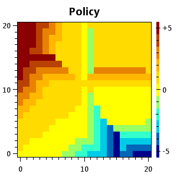
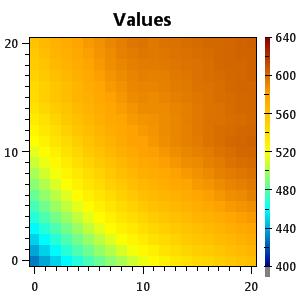
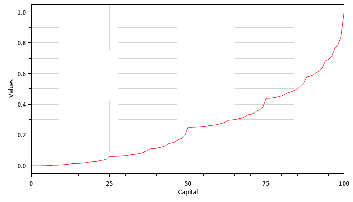
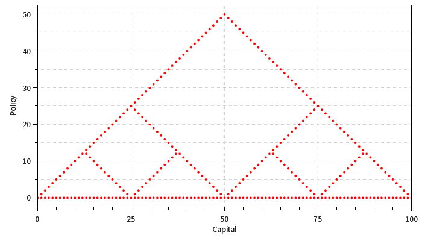
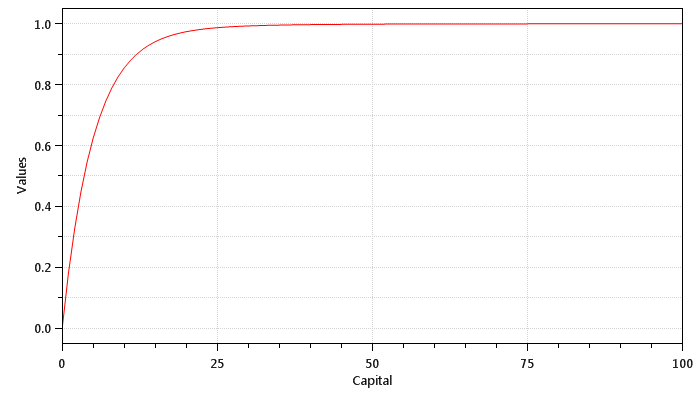
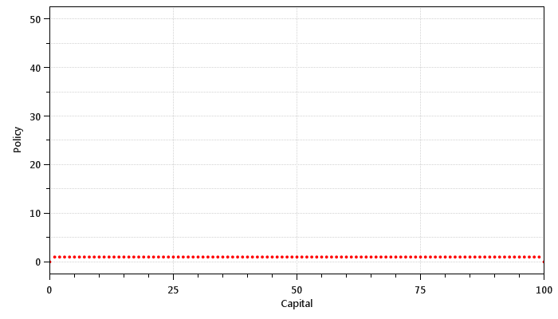

## Dynamic Programming

*Chapter 4*

#### Gridworld

This is a reproduction of Figure 4.2 from the book:

* k = 0

* k = 1

* k = 2

* k = 3

* k = 10

* k = 1000

This represents the solution to Exercise 4.2 from the book:

* k = 1000

#### Jack's Car Rental

This is a reproduction of Figure 4.4 from the book:

* Iteration 0

* Iteration 1

* Iteration 2

* Iteration 3

* Iteration 4

This represents the solution to Exercise 4.5 from the book:

* Iteration 4

#### Gambler's Problem

This is a reproduction of Figure 4.6 from the book:

* Sweep 0

* Sweep 1

* Sweep 2

* Sweep 3

* Sweep 32

This represents the solution to Exercise 4.9 from the book:

* Sweep 1000, ph = 0.25

* Sweep 1000, ph = 0.55

