## Dynamic Programming

*Chapter 4*

#### Gridworld

This is a reproduction of Figure 4.2 from the book:

* k = 0

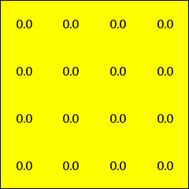

* k = 1

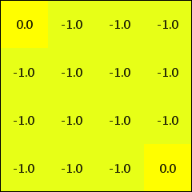

* k = 2

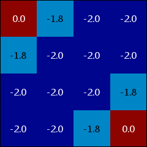

* k = 3

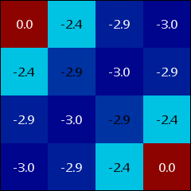

* k = 10

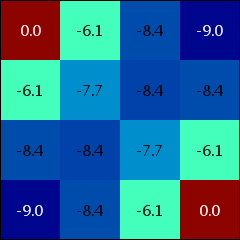

* k = 1000

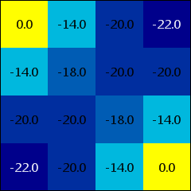

This represents the solution to Exercise 4.2 from the book:

* k = 1000

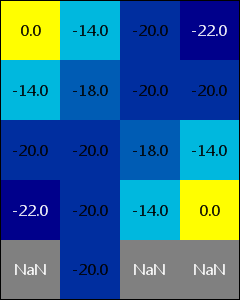

#### Jack's Car Rental

This is a reproduction of Figure 4.4 from the book:

* Iteration 0

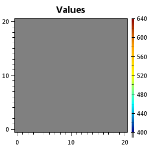

* Iteration 1

* Iteration 2

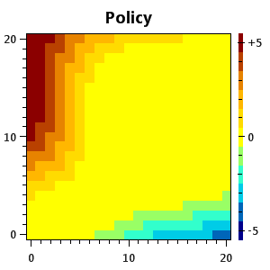
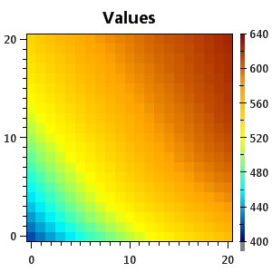

* Iteration 3

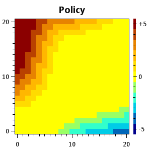
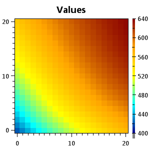

* Iteration 4

#### Gambler's Problem

This is a reproduction of Figure 4.6 from the book:

* Sweep 0

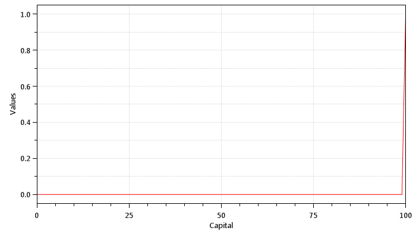

* Sweep 1

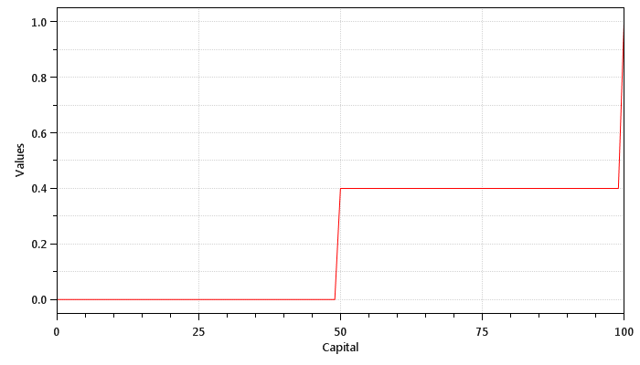

* Sweep 2

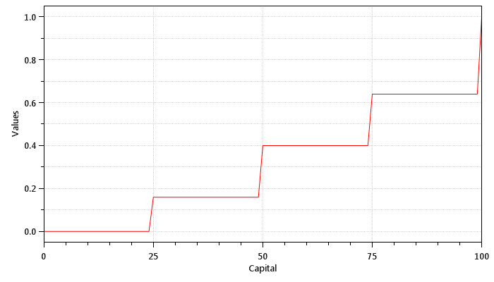

* Sweep 3

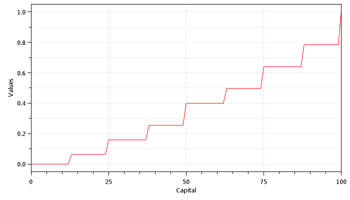

* Sweep 32

