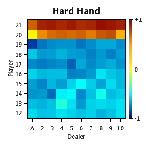
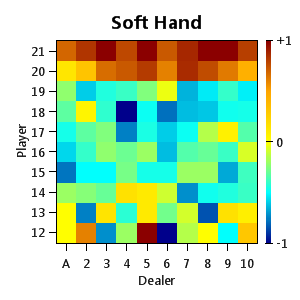
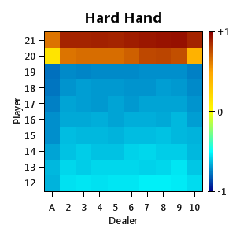
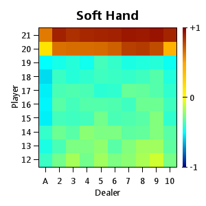
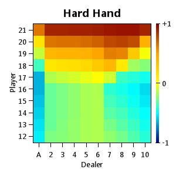
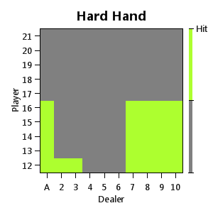
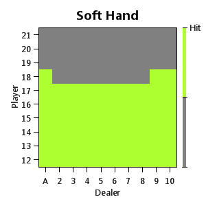
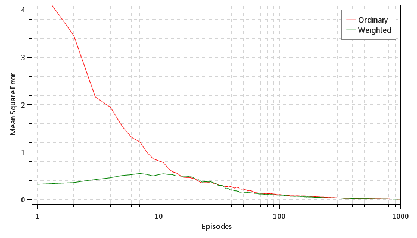
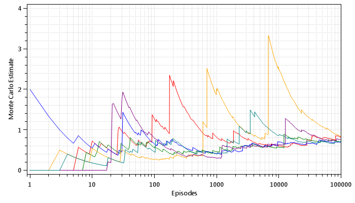

## Monte Carlo Methods

*Chapter 5*

#### Blackjack

This is a reproduction of Figure 5.2 from the book:

* Episode 10000

* Episode 500000

#### Solving Blackjack

This is a reproduction of Figure 5.5 from the book:

* Values

* Policy

#### Off-policy Estimation of a Blackjack State Value

This is a reproduction of Figure 5.7 from the book:

#### Infinite Variance

This is a reproduction of Figure 5.8 from the book:

