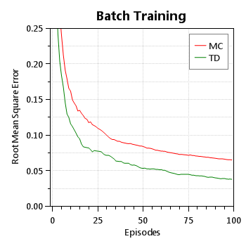
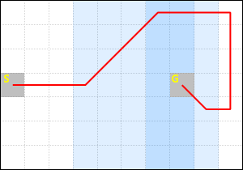
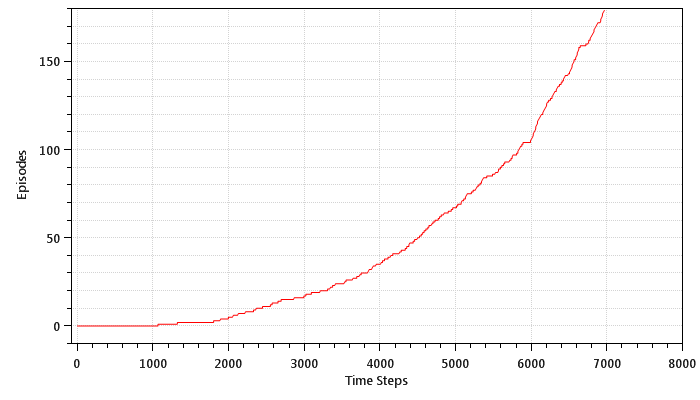
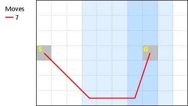
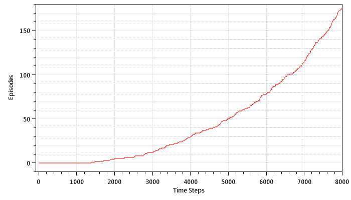

## Temporal-Difference Learning

*Chapter 6*

#### Random Walk

This is a reproduction of Figure 6.6 from the book:

This is a reproduction of Figure 6.7 from the book:

#### Random Walk under Batch Updating

This is a reproduction of Figure 6.8 from the book:

#### Windy Gridworld

This is a reproduction of Figure 6.11 from the book:

* Standard moves

This represents the solution to Exercise 6.6 from the book:

* King's moves

* King's moves with drift

